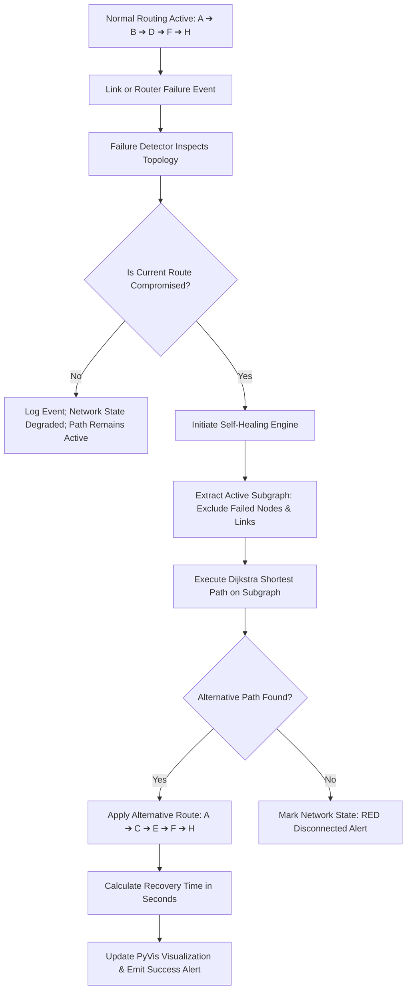

# MeshGuard – Self-Healing Computer Network Simulator

[](https://www.python.org/)
[](https://streamlit.io/)
[](https://networkx.org/)
[](https://pyvis.readthedocs.io/)

A modern, interactive Computer Networks mini-project built with **Streamlit**, **NetworkX**, and **PyVis** demonstrating dynamic routing, failure detection, and automated self-healing network rerouting using Dijkstra's shortest path algorithm.

---

## 📌 Problem Statement

In mission-critical computer networks (data centers, telecom backbones, ISP backbones, and IoT mesh networks), physical link cuts, router hardware failures, and network congestion regularly disrupt packet delivery. Traditional static routing fails completely when a link or node drops. Networks require **fault-tolerant dynamic rerouting** (similar to OSPF, IS-IS, and real-time navigation systems like Google Maps) that can automatically detect outages in milliseconds and reroute active traffic through redundant alternative paths without human intervention.

---

## 💡 Solution: MeshGuard

**MeshGuard** is a web-based network simulator that models an 8-router interconnected mesh topology. It simulates real-time failure injection (node crash or link sever), automated failure detection, Dijkstra dynamic path recomputation, and transparent self-healing:

```
Normal Active Path:
A ──(2)──► B ──(3)──► D ──(3)──► F ──(2)──► H   [Total Cost = 10]

If Link D-F or Router D fails:
MeshGuard Failure Detector identifies outage in milliseconds.

Self-Healing Reroute:
A ──(4)──► C ──(3)──► E ──(3)──► F ──(2)──► H   [Alternative Cost = 12]
(or via E ──► G ──► H)

Result: "Network Successfully Recovered in 0.035 seconds"
```

---

## 🎯 Objectives

1. Demonstrate core **Computer Networking** concepts: dynamic routing, metric weights, adjacency graphs, and fault recovery.
2. Implement **Dijkstra's Shortest Path Algorithm** on an active subgraph excluding failed nodes and links.
3. Provide an intuitive, interactive **visualization dashboard** with real-time color-coded router and link states.
4. Simulate **hop-by-hop packet transmission** and calculate real-time delivery vs packet loss metrics.
5. Provide live network monitoring, audit logs, and self-healing convergence latency measurement.

---

## 🛠 Technology Stack

* **Programming Language:** Python 3.10+
* **Web Dashboard:** Streamlit
* **Graph & Topology Modeling:** NetworkX
* **Interactive Visualization:** PyVis (Vis.js HTML5 canvas) & Matplotlib (static fallback)
* **Shortest Path Algorithm:** Dijkstra's Algorithm (Priority Queue / Min-Heap)
* **Data Storage:** JSON (`data/topology.json`)
* **Event Auditing:** Python standard `logging` library (`meshguard.log`)

---

## 🌟 Main Features

1. **8-Router Redundant Mesh Topology:**
   - Preconfigured with routers `A`, `B`, `C`, `D`, `E`, `F`, `G`, `H`.
   - 13 weighted bidirectional links providing multiple redundant failover paths.
2. **Interactive Topology Visualization:**
   - 🟢 **Active Router:** Green circular node.
   - 🔴 **Failed Router:** Red circular node.
   - 🔵 **Active Routing Path:** Bold blue line with cost labels.
   - ── **Active Link:** Solid slate gray line with metric cost.
   - ┈┈ **Failed Link:** Dashed red line.
3. **Source & Destination Shortest Path Routing:**
   - Dropdown selection for any source and destination router.
   - Instant calculation of lowest-cost path using Dijkstra's algorithm.
   - Displays hop breakdown and cumulative path cost.
4. **Hop-by-Hop Packet Transmission Simulation:**
   - Simulates virtual packet traversal from router to router.
   - Verifies link and node availability at each hop.
   - Real-time counters: *Packets Sent*, *Packets Delivered*, *Packets Lost*.
5. **Interactive Link Failure Simulation:**
   - Select any operational link (e.g., `D-F`) and trigger failure.
   - Visualizer updates link to dashed red.
6. **Router Failure Simulation (Cascading Outage):**
   - Select any active router (e.g., `Router D`) and simulate hardware shutdown.
   - Automatically renders the router red and disables all incident links.
7. **Automated Failure Detection:**
   - Simulated monitoring engine inspects active paths and reports compromised elements.
8. **Real-Time Self-Healing Engine:**
   - Instantly intercepts route disruption, triggers Dijkstra on the remaining operational subgraph, and applies an alternative path.
   - Computes network convergence / recovery latency (e.g., `0.035 s`).
9. **Component Restoration:**
   - Restore failed links or routers individually.
   - Automatically refreshes routing tables and optimizes active paths.
10. **Full Network Reset:**
    - Single-click restore returning all 8 routers and 13 links to healthy state, resetting packet counters.
11. **Live Event Logs Console:**
    - Real-time timestamped audit trail of all network operations.
12. **Real-Time Dashboard Metrics:**
    - Displays 10 live metrics: Total Routers, Active Routers, Failed Routers, Total Links, Active Links, Failed Links, Packets Sent, Delivered, Lost, and Last Recovery Time.

---

## 🏗 Project Architecture

```
MeshGuard/
│
├── app.py                      # Main Streamlit web application & UI dashboard
├── requirements.txt            # Project dependencies
├── README.md                   # Complete project documentation & guide
├── test_suite.py               # Automated test suite for all 10 requirements
├── test_meshguard.py           # Quick verification test script
├── meshguard.log               # Persistent audit logs generated by Python logging
│
├── data/
│   └── topology.json           # Network router coordinates and link costs
│
├── network/
│   ├── __init__.py             # Network package exports
│   ├── topology.py             # JSON loader and graph builder
│   ├── manager.py              # Operational state manager (nodes/links status)
│   └── visualizer.py           # PyVis & Matplotlib rendering engines
│
├── routing/
│   ├── __init__.py             # Routing package exports
│   └── dijkstra.py             # Dijkstra shortest path & hop trace algorithm
│
├── monitoring/
│   ├── __init__.py             # Monitoring package exports
│   └── failure_detector.py     # Path integrity checker & health status evaluator
│
├── healing/
│   ├── __init__.py             # Self-healing package exports
│   └── self_healing.py         # Autonomous rerouting & convergence time tracker
│
└── simulation/
    ├── __init__.py             # Simulation package exports
    └── packet.py               # Hop-by-hop packet forwarding simulation
```

---

## ⚙ Installation & Setup

### 1. Clone or Open Project Directory
```bash
cd "c:\Users\Administrator\Desktop\CN mini project"
```

### 2. Install Dependencies
```bash
pip install -r requirements.txt
```

### 3. Run Automated Tests
```bash
python test_suite.py
```
*(All 10 test cases will execute and report `OK`)*

### 4. Launch MeshGuard Simulator
```bash
streamlit run app.py
```
Open your web browser at `http://localhost:8501`.

---

## 🔄 How Self-Healing Works



1. **Failure Injection:** An operator or environmental fault drops a link (e.g. `B-D`) or a node (e.g. `Router D`).
2. **Monitoring Detection:** The `FailureDetector` checks whether the active path traverses the failed component.
3. **Subgraph Isolation:** The `NetworkManager` generates an active subgraph $G_{active} = (V_{active}, E_{active})$ where all failed routers and incident links are excluded.
4. **Dijkstra Recomputation:** `find_shortest_path(G_active, source, destination)` computes the new optimal route minimizing $\sum weight$.
5. **State Transition:** The simulator logs the event, updates packet counters, recalculates recovery elapsed time, and re-renders the interactive PyVis graph.

---

## 🎬 Step-by-Step Demo Scenario for College Viva

1. **Step 1 - Initial State:**
   - Set **Source** to `A` and **Destination** to `H`.
   - Click **🔍 Find Best Route**.
   - Result: `A → B → D → F → H` with **Total Cost: 10**.
   - The path is highlighted in vibrant blue on the topology graph.

2. **Step 2 - Packet Transmission:**
   - Click **🚀 Send Packet**.
   - The log shows hop-by-hop forwarding: `A → B`, `B → D`, `D → F`, `F → H`.
   - *Packets Delivered* increments to `1`, *Packets Lost* remains `0`.

3. **Step 3 - Simulate Link Failure:**
   - Under **Failure Simulation** > **Link Failure**, select `D - F`.
   - Click **💥 Fail Link**.
   - Observe:
     - Warning banner: `⚠ Failure Detected & Self-Healing Triggered`.
     - Link `D - F` turns into a red dashed line.
     - Self-healing automatically finds alternative route: `A → B → D → H` (Cost: 11) or `A → C → E → F → H` (Cost: 12).
     - Recovery Time: `0.035 s`.
     - Network Status updates to `🟡 RECOVERED / DEGRADED`.

4. **Step 4 - Transmit Over Recovered Path:**
   - Click **🚀 Send Packet**.
   - The packet seamlessly travels along the new route with zero packet loss.

5. **Step 5 - Simulate Router Failure:**
   - Under **Router Failure**, select `Router D` and click **🛑 Fail Router**.
   - Router D turns red; all connections to D are severed.
   - MeshGuard reroutes around D: `A → C → E → F → H` (Cost: 12).

6. **Step 6 - Total Disconnection Scenario:**
   - Fail `Router F` and `Router G`.
   - Router H is now isolated.
   - Status transitions to `🔴 NETWORK DISCONNECTED`.
   - System displays: *"Network could not recover because no alternative path is available."*

7. **Step 7 - Restoration & Reset:**
   - Select failed elements under **Recovery Controls** and restore them, or click **♻ Reset Network to Default**.
   - Network returns to `🟢 HEALTHY` with all 8 routers operational.

---

## 🔮 Future Enhancement Ideas

- **OSPF LSA Flooding Simulation:** Model link-state advertisements (LSAs) and shortest path first (SPF) recalculation timers.
- **Dynamic Bandwidth & Congestion:** Vary link weights dynamically based on simulated link congestion or packet queue depth.
- **Multi-Path Routing (ECMP):** Support Equal-Cost Multi-Path routing across parallel topological paths.
- **Custom Topology Editor:** Allow users to add custom routers and drag-and-drop new links directly from the web interface.

---

## 👨‍💻 Project Information

- **Course:** Computer Networks Mini Project
- **Project Name:** MeshGuard – Self-Healing Computer Network Simulator
- **Evaluation Criteria:** Demonstrates routing algorithms, fault detection, self-healing rerouting, packet simulation, interactive UI, and live telemetry.

