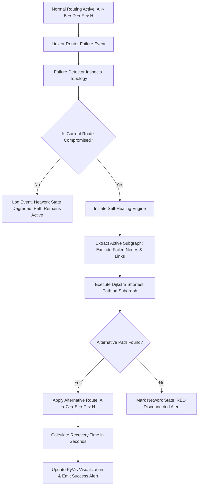

# MeshGuard – Secure Self-Healing Network Simulator

> MeshGuard is a secure self-healing network simulator that detects abnormal routing behaviour from compromised clients, blocks unauthorized communication paths, and automatically recovers a valid route using dynamic path selection.

[](https://www.python.org/)
[](https://streamlit.io/)
[](https://networkx.org/)
[](https://pyvis.readthedocs.io/)

A modern, interactive Computer Networks mini-project built with **Streamlit**, **NetworkX**, and **PyVis** demonstrating dynamic routing, failure detection, and automated self-healing network rerouting using Dijkstra's shortest path algorithm.

---

## 📌 Problem Statement

Physical failures are only one source of disruption: a compromised simulated client can also propose an unknown router, unauthorized node, disconnected path, incorrect destination, or unexpected route. MeshGuard validates client requests before forwarding and recovers a trusted path without disabling other clients. This is a graph simulation, not detection of real human hackers.

In mission-critical computer networks (data centers, telecom backbones, ISP backbones, and IoT mesh networks), physical link cuts, router hardware failures, and network congestion regularly disrupt packet delivery. Traditional static routing fails completely when a link or node drops. Networks require **fault-tolerant dynamic rerouting** (similar to OSPF, IS-IS, and real-time navigation systems like Google Maps) that can automatically detect outages in milliseconds and reroute active traffic through redundant alternative paths without human intervention.

---

## 💡 Solution: MeshGuard

**MeshGuard** is a web-based network simulator that models an 8-router interconnected mesh topology. It simulates real-time failure injection (node crash or link sever), automated failure detection, Dijkstra dynamic path recomputation, and transparent self-healing:

```
Normal Active Path:
A ──(2)──► B ──(3)──► D ──(3)──► F ──(2)──► H   [Total Cost = 10]

If Link D-F or Router D fails:
MeshGuard Failure Detector identifies outage in milliseconds.

Self-Healing Reroute:
A ──(4)──► C ──(3)──► E ──(3)──► F ──(2)──► H   [Alternative Cost = 12]
(or via E ──► G ──► H)

Result: "Network Successfully Recovered in 0.035 seconds"
```

---

## 🎯 Objectives

1. Demonstrate core **Computer Networking** concepts: dynamic routing, metric weights, adjacency graphs, and fault recovery.
2. Implement **Dijkstra's Shortest Path Algorithm** on an active subgraph excluding failed nodes and links.
3. Provide an intuitive, interactive **visualization dashboard** with real-time color-coded router and link states.
4. Simulate **hop-by-hop packet transmission** and calculate real-time delivery vs packet loss metrics.
5. Provide live network monitoring, audit logs, and self-healing convergence latency measurement.

---

## 🛠 Technology Stack

* **Programming Language:** Python 3.10+
* **Web Dashboard:** Streamlit
* **Graph & Topology Modeling:** NetworkX
* **Interactive Visualization:** PyVis (Vis.js HTML5 canvas) & Matplotlib (static fallback)
* **Shortest Path Algorithm:** Dijkstra's Algorithm (Priority Queue / Min-Heap)
* **Data Storage:** JSON (`data/topology.json`)
* **Event Auditing:** Python standard `logging` library (`meshguard.log`)

---

## 🌟 Main Features

1. **8-Router Redundant Mesh Topology:**
   - Preconfigured with routers `A`, `B`, `C`, `D`, `E`, `F`, `G`, `H`.
   - 13 weighted bidirectional links providing multiple redundant failover paths.
2. **Interactive Topology Visualization:**
   - 🟢 **Active Router:** Green circular node.
   - 🔴 **Failed Router:** Red circular node.
   - 🔵 **Active Routing Path:** Bold blue line with cost labels.
   - ── **Active Link:** Solid slate gray line with metric cost.
   - ┈┈ **Failed Link:** Dashed red line.
3. **Source & Destination Shortest Path Routing:**
   - Dropdown selection for any source and destination router.
   - Instant calculation of lowest-cost path using Dijkstra's algorithm.
   - Displays hop breakdown and cumulative path cost.
4. **Hop-by-Hop Packet Transmission Simulation:**
   - Simulates virtual packet traversal from router to router.
   - Verifies link and node availability at each hop.
   - Real-time counters: *Packets Sent*, *Packets Delivered*, *Packets Lost*.
5. **Interactive Link Failure Simulation:**
   - Select any operational link (e.g., `D-F`) and trigger failure.
   - Visualizer updates link to dashed red.
6. **Router Failure Simulation (Cascading Outage):**
   - Select any active router (e.g., `Router D`) and simulate hardware shutdown.
   - Automatically renders the router red and disables all incident links.
7. **Automated Failure Detection:**
   - Simulated monitoring engine inspects active paths and reports compromised elements.
8. **Real-Time Self-Healing Engine:**
   - Instantly intercepts route disruption, triggers Dijkstra on the remaining operational subgraph, and applies an alternative path.
   - Computes network convergence / recovery latency (e.g., `0.035 s`).
9. **Component Restoration:**
   - Restore failed links or routers individually.
   - Automatically refreshes routing tables and optimizes active paths.
10. **Full Network Reset:**
    - Single-click restore returning all 8 routers and 13 links to healthy state, resetting packet counters.
11. **Live Event Logs Console:**
    - Real-time timestamped audit trail of all network operations.
12. **Real-Time Dashboard Metrics:**
    - Displays 10 live metrics: Total Routers, Active Routers, Failed Routers, Total Links, Active Links, Failed Links, Packets Sent, Delivered, Lost, and Last Recovery Time.

---

## 🏗 Project Architecture

```
MeshGuard/
│
├── app.py                      # Main Streamlit web application & UI dashboard
├── requirements.txt            # Project dependencies
├── README.md                   # Complete project documentation & guide
├── test_suite.py               # Automated test suite for all 10 requirements
├── test_meshguard.py           # Quick verification test script
├── test_security.py            # Route validation, isolation and recovery tests
├── test_security_ui.py         # Streamlit demo and failure-control regression
├── meshguard.log               # Persistent audit logs generated by Python logging
│
├── data/
│   └── topology.json           # Network router coordinates and link costs
│
├── network/
│   ├── __init__.py             # Network package exports
│   ├── topology.py             # JSON loader and graph builder
│   ├── manager.py              # Operational state manager (nodes/links status)
│   └── visualizer.py           # PyVis & Matplotlib rendering engines
│
├── routing/
│   ├── __init__.py             # Routing package exports
│   └── dijkstra.py             # Dijkstra shortest path & hop trace algorithm
│
├── monitoring/
│   ├── __init__.py             # Monitoring package exports
│   └── failure_detector.py     # Path integrity checker & health status evaluator
│
├── healing/
│   ├── __init__.py             # Self-healing package exports
│   └── self_healing.py         # Autonomous rerouting & convergence time tracker
│
├── security/
│   ├── __init__.py
│   ├── threat_detector.py      # Client state, configurable policy and validation
│   ├── attack_simulator.py     # Invalid route proposals; no network mutations
│   ├── monitor.py              # Request gate, shared healing, bounded event history
│   └── panel.py                # Security Monitor presentation
│
└── simulation/
    ├── __init__.py             # Simulation package exports
    └── packet.py               # Hop-by-hop packet forwarding simulation
```

---

## ⚙ Installation & Setup

### 1. Clone or Open Project Directory
```bash
git clone https://github.com/yugindhanam/MeshGuard.git
cd MeshGuard
```

### 2. Install Dependencies
```bash
python -m pip install -r requirements.txt
```

### 3. Run Automated Tests
```bash
python -m unittest discover -v
python test_meshguard.py
```
The suite includes original routing/failure tests, security enforcement tests and a Streamlit AppTest demonstration.

### 4. Launch MeshGuard Simulator

#### Option A: Next.js + FastAPI Full-Stack (Recommended)
1. Double-click `start-all.bat` (or run `./start-all.bat` in terminal).
2. Alternatively, run both manually:
   - **Backend:** `python -m uvicorn backend.server:app --port 8000 --reload` (or `start-backend.bat`)
   - **Frontend:** `cd frontend && npm install && npm run dev` (or `start-frontend.bat`)
3. Open your browser at **`http://localhost:3000`** (Next.js Dashboard) and **`http://localhost:8000/docs`** (FastAPI Swagger UI).

#### Option B: Streamlit Dashboard
```bash
python -m streamlit run app.py
```
Open your web browser at `http://localhost:8501`.

The dashboard provides navigation links for **Network overview**, **Security monitor**, and **Activity & logs**. Client cards show current status, trust score, blocked proposals and delivered requests. The incident panel follows detection → blocking → recovery → delivery beside the topology. Shared styling and presentation helpers live in `ui/`; the layout adapts to narrow screens.

## Security: Three Clients and One Database

Client 1, Client 2 and Client 3 are logical endpoints attached to Router A. The database service is represented by destination Router H; no real database is required. Router IDs, topology and the original arbitrary router-to-router tools remain unchanged. Each client has its own route, expected route, status, score and delivery count. Security requests use the existing `PacketSimulator`, so successful database deliveries also appear in the main packet counters.

### Detection and trust policy

Every database request passes through `SecurityMonitor.request_database` before any packet is forwarded. The detector checks route shape, source, destination, node/edge existence, loops, node trust, client authorization and operational availability. A connected, authorized path that differs from the server's expected route is classified SUSPICIOUS; structurally invalid or unauthorized paths are MALICIOUS. Both are blocked and replaced. These labels describe simulated routing behaviour, not a determination of human intent.

| Indicator | Default score deduction |
| --- | ---: |
| Unknown node, missing edge, loop, wrong endpoint or malformed path | 40 per proposal |
| Unauthorized node | 40 per proposal |
| Unexpected route change | 20 |
| Third and subsequent unexpected changes during the session | Additional 10 |

`SecurityPolicy` in `security/threat_detector.py` configures deductions and the repeated-change threshold. Independent deductions accumulate, with scores clamped at zero. Classification depends on the rule violated, not an arbitrary score threshold. The score remains an incident history after recovery and resets with **Reset Entire Network to Default**.

Nodes default to trusted. Set `"trusted": false` on a router in `data/topology.json` to exclude it from security routes. `ClientState.allowed_nodes` optionally restricts a client to an explicit set of router IDs. Recovery applies both policies, including to the source and database destination.

The existing application has no RTT or clock-drift measurements. Security therefore uses route evidence only; it does not generate fabricated RTT, drift or packet-loss anomalies. Blocked proposals are counted separately from packet loss because they never enter packet forwarding.

### Shared recovery workflow

```text
Network monitoring -> Failed equipment ----+
                                          |
Security monitoring -> Invalid proposal -> Block
                                          |
                         Existing SelfHealingEngine
                                          |
                         Active, authorized subgraph
                                          |
                         Existing Dijkstra function
                                          |
                         Revalidate selected route
                                          |
                         Existing PacketSimulator -> Database H
```

The simulated attack proposes `A -> Unauthorized X -> H`. X and its links exist only in the display overlay; the routing graph and host network settings never change. The lifecycle is recorded as SUSPICIOUS → MALICIOUS → blocked → RECOVERED, followed by a retried database request on a validated route. If no active trusted route exists, status becomes ISOLATED, no packet is sent, and connectivity restoration enables recovery. Ordinary hardware failures heal client routes without reducing trust or marking clients malicious. Automatic infrastructure reroutes update the expected route to avoid false route-change alerts.

### Security demonstration

1. Launch the app and scroll to **Security Monitor**. All three clients start NORMAL with `A → B → D → F → H`.
2. Click **Send From All Clients**. Each client's last request becomes **Database reached**.
3. Select **Client 2** and click **Simulate Malicious Behaviour**.
4. Inspect the incident: previous path, red blocked proposal, explicit reasons, recovered path and confirmed database delivery. Client 2 is RECOVERED; Clients 1 and 3 remain NORMAL.
5. The security topology shows all three clients and Database H, using the existing cyan safe-route and red dashed blocked-route conventions. The **Render Engine** selection also switches this view between PyVis and Matplotlib.
6. Expand **Security event log** for the intermediate states; events also reach the existing NOC audit console and `meshguard.log`. The dedicated session history retains the latest 300 entries. Incident details remain visible across reruns and are labeled historical.
7. Use the original **Failure Injection** controls to sever D–F or crash D. Client paths recover through the same healing engine without trust penalties.
8. Crash H to isolate the database, then send a request. No delivery is claimed. Restore H in **Recovery & Reset**, then retry. Reset the entire network to clear client incidents, scores and counters.

Suggested screenshots for a report: the three NORMAL clients after step 2; Client 2's blocked overlay and recovered route after step 4; the security event log; and the ISOLATED state after crashing H.

### Limits and future security work

This is a synchronous, in-memory educational simulation. It has no authentication, real traffic inspection, real database, or persistent client policy store. The original **Transmit Packet** control remains a raw router-to-router demonstration; database client traffic must use the Security Monitor gateway. Recovery establishes a safe route, not remediation of a real compromised device. A repeated simulated attack is a new explicit button click, not ongoing malware. Existing recovery latency includes a synthetic convergence offset and is not a measured network RTT.

Future work could add configurable client policies in the UI, an explicit policy-reset control, sliding-window anomaly scoring, measured simulated latency/loss inputs, and exported incident reports.

---

## 🔄 How Self-Healing Works



1. **Failure Injection:** An operator or environmental fault drops a link (e.g. `B-D`) or a node (e.g. `Router D`).
2. **Monitoring Detection:** The `FailureDetector` checks whether the active path traverses the failed component.
3. **Subgraph Isolation:** The `NetworkManager` generates an active subgraph $G_{active} = (V_{active}, E_{active})$ where all failed routers and incident links are excluded.
4. **Dijkstra Recomputation:** `find_shortest_path(G_active, source, destination)` computes the new optimal route minimizing $\sum weight$.
5. **State Transition:** The simulator logs the event, updates packet counters, recalculates recovery elapsed time, and re-renders the interactive PyVis graph.

---

## 🎬 9-Step Project Demonstration & Viva Walkthrough

Use this comprehensive 9-step sequence to showcase both **Network Failure Self-Healing** and **Client Security Testing**:

1. **Step 1 — Start with 3 Normal Clients:**
   - Observe initial topology: 3 simulated clients connected to Router A, with healthy routing paths to the shared Database at Router H.
   - Summary cards report `3 Active Clients`, `8 / 8 Active Routers`, and `NETWORK HEALTHY`.

2. **Step 2 — Inspect Current Paths and Client Telemetry Table:**
   - Navigate to the **Client Status & Measured Telemetry** table.
   - Review baseline routes (`A → B → D → F → H`), measured RTT (`20.0 ms`), Drift (`0.0 ms (Optimal)`), and 100/100 Trust Scores.

3. **Step 3 — Trigger Router or Link Failure:**
   - In the **Network Failure Testing** tab, under *Failure Injection*, select Link `D - F` and click **💥 Sever Link** (or crash `Router D`).

4. **Step 4 — Observe Autonomous Self-Healing:**
   - Link `D - F` turns dashed red on the topology graph.
   - Self-healing banner displays root cause, compromised path, and recomputed alternative route (`A → B → D → H` or `A → C → E → F → H`).
   - Recovery latency is measured in real time (e.g., `0.035 s`).
   - Workflow panel updates to **RECOVER** with active telemetry status.

5. **Step 5 — Restore or Reset Network:**
   - Under *Recovery & Reset*, click **🔄 Restore Selected Link** or **♻ Reset Entire Network** to return to pristine baseline.

6. **Step 6 — Simulate a Malicious Client:**
   - Switch to the **Security Testing — Simulate a Malicious Client** tab.
   - Select **Client 2** from the client dropdown.
   - Click **💥 Simulate Malicious Route**.

7. **Step 7 — Observe Route Validation & Rejection:**
   - Rogue route proposing nonexistent node `Unauthorized X` is intercepted by the security request gate.
   - Threat detector evaluates topology rules, raises a **SECURITY ALERT**, and flags the proposal as `MALICIOUS`.
   - The invalid route is **rejected and blocked** before packet forwarding (zero packets delivered on rogue path).
   - Trust score drops from 100 to 60.

8. **Step 8 — Autonomous Safe Route Recovery via Dijkstra:**
   - The self-healing engine recomputes a verified shortest path exclusively over authorized, trusted nodes.
   - Client 2 transitions to `RECOVERED` status, and the request reaches Database H safely.
   - The incident walkthrough displays the 7-step mitigation flow with side-by-side path comparison cards.

9. **Step 9 — Confirm Other Clients Remain Unaffected:**
   - Check the Client Telemetry Table: **Client 1** and **Client 3** maintain pristine 100 Trust Scores, `NORMAL` security status, and unbroken database connectivity.
   - Click **🔄 Reset Security Simulation** to return security reputation scores to baseline.

---

## 🔮 Future Enhancement Ideas

- **OSPF LSA Flooding Simulation:** Model link-state advertisements (LSAs) and shortest path first (SPF) recalculation timers.
- **Dynamic Bandwidth & Congestion:** Vary link weights dynamically based on simulated link congestion or packet queue depth.
- **Multi-Path Routing (ECMP):** Support Equal-Cost Multi-Path routing across parallel topological paths.
- **Custom Topology Editor:** Allow users to add custom routers and drag-and-drop new links directly from the web interface.

---

## 👨‍💻 Project Information

- **Course:** Computer Networks Mini Project
- **Project Name:** MeshGuard – Self-Healing Computer Network Simulator
- **Evaluation Criteria:** Demonstrates routing algorithms, fault detection, self-healing rerouting, packet simulation, interactive UI, and live telemetry.

